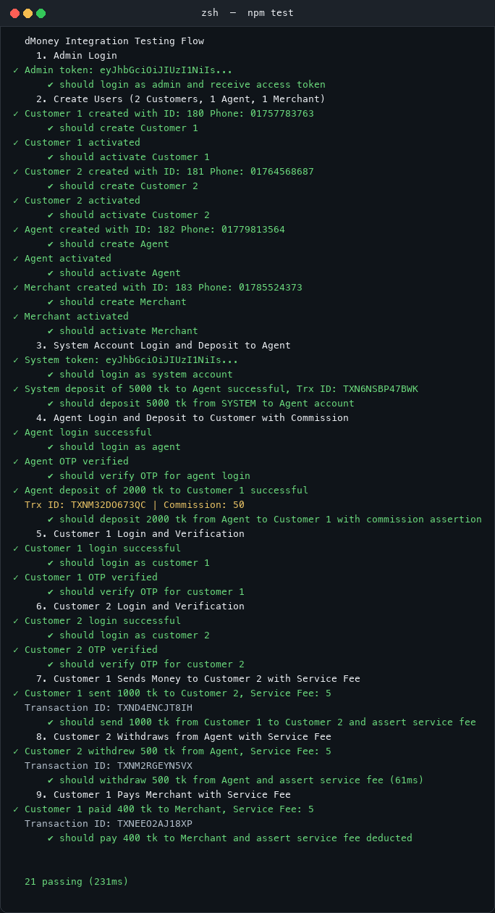

# dMoney Integration Tests

Mocha + Chai integration test suite for the dMoney MFS platform, defined in [`dmoney.spec.js`](./dmoney.spec.js). It exercises the full business flow end-to-end against a running `dmoney-transaction-api` backend, using `axios` to call the real HTTP endpoints.

## Prerequisites

- Node.js (with npm)
- The `dmoney-transaction-api` backend running and reachable on port `4000`

## Setup

Install dependencies (from this directory):

```bash
npm install
```

Configure the backend address and credentials by editing the constants at the top of `dmoney.spec.js`:

| Constant        | Default                    | Description                                    |
| --------------- | -------------------------- | ---------------------------------------------- |
| `BASE_URL`      | `http://localhost:4000`    | Backend API base URL                           |
| `API_SECRET_KEY`| `ROADTOSDET`               | `X-AUTH-SECRET-KEY` header value (partner key) |
| `DEFAULT_OTP`   | `0000`                     | OTP accepted in dev env (`?env=dev`)           |

## What the suite covers

The flow (in dependency order):

1. **Admin login** — `POST /user/login` with `admin@dmoney.com`, captures admin JWT.
2. **User creation** — admin creates 2 Customers, 1 Agent, and 1 Merchant via `POST /user/create`, then activates each via `PATCH /user/update/:id`.
3. **System deposit** — SYSTEM account (`system@dmoney.com`) deposits **5,000 tk** to the Agent; asserts no commission is charged.
4. **Agent deposit** — Agent deposits **2,000 tk** to Customer 1; asserts a `commission` is present in the response.
5. & 6. **Customer logins** — Customer 1 and Customer 2 log in and verify OTP (`?env=dev`).
7. **Send money** — Customer 1 sends **1,000 tk** to Customer 2; asserts a `fee` is present.
8. **Withdrawal** — Customer 2 withdraws **500 tk** from the Agent; asserts a `fee` is present.
9. **Payment** — Customer 1 pays the Merchant **400 tk**; asserts a `fee` is present.

Test data (emails, phone numbers, user IDs, tokens) is generated per run with a `Date.now()` timestamp, so each run uses unique accounts.

## Running the tests

```bash
npm test             # single run (10s timeout per test)
npm run test:watch   # watch mode
```

Or directly:

```bash
npx mocha dmoney.spec.js --timeout 10000
```

## Sample output

Console log from a successful run (all 21 tests passing):



## Notes

- Run with the backend **and its MySQL database** up; the suite assumes the seeded admin (`admin@dmoney.com`) and SYSTEM (`system@dmoney.com`) accounts exist with password `1234`.
- Every test run creates new users and performs real transactions, so it mutates the backend database.
- The suite asserts key response contracts (e.g. `trnxId`, `fee`, `commission` present, expected HTTP status codes) but does not independently verify final ledger balances.